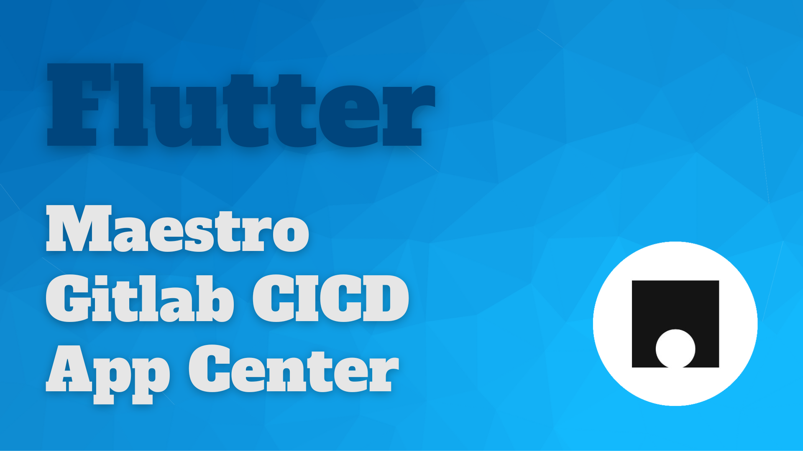
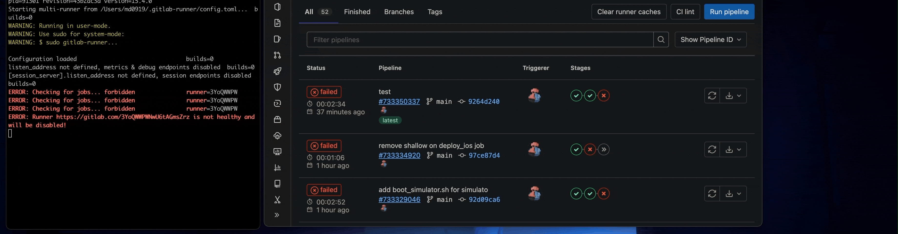
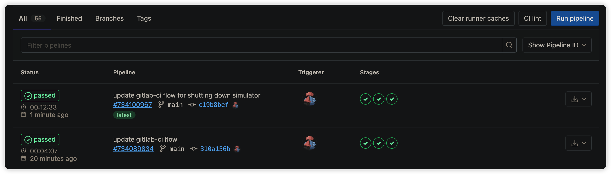

# maestro_gitlab_cicd_for_flutter

  
  &nbsp
  
  &nbsp
  

**Maestro** 是一個端對端測試的解決方案，即使不是開發人員也可以很容易地編寫測試細節。 我將 Maestro 測試添加到 Gitlab CICD 中，協助驗證 Flutter 應用。 在過程中，透過腳本啟動本地模擬器、執行多流程驗證並顯示報告，最後關閉模擬器。

在這個範例中，如果測試都沒有問題，則開始建置應用程序並將它部署到 App Center。

## Scripts
- [boot_simulator.sh](./scripts/boot_simulator.sh)
- [run_test.sh](./scripts/run_test.sh)
- [shutdown_simulator.sh](./scripts/shutdown_simulator.sh)

## Gitlab-CI
[Click here and check the settings.](./.gitlab-ci.yml)

## Demo

## Contribute
- 如果你有學到東西，感覺不錯的話，可以給星並分享讓其他開發人員知道，讓更多人受益
- 有什麼想法的話，請和我討論或提交 PR

## More of me

## Donate and encourage me
[![BuyMeACoffee][buy_me_a_coffee_badge]][buy_me_a_coffee]

<!-- Links -->
[buy_me_a_coffee]: https://www.buymeacoffee.com/yiichenhi
[buy_me_a_coffee_badge]: https://img.buymeacoffee.com/button-api/?text=Sponsor&emoji=&slug=yiichenhi&button_colour=FFDD00&font_colour=000000&font_family=Cookie&outline_colour=000000&coffee_colour=ffffff&size=64
